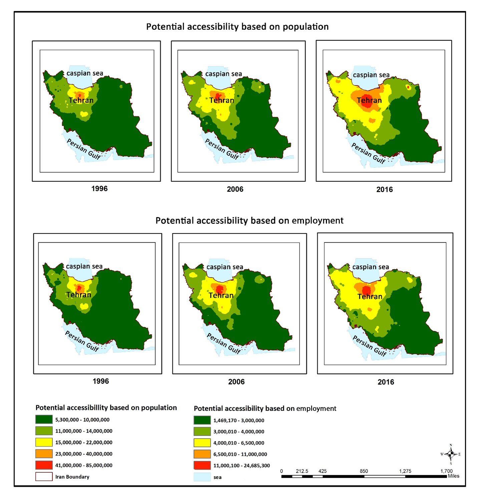

<!-- README.md is generated from README.Rmd. Please edit that file -->

```{r, include = FALSE}
knitr::opts_chunk$set(
  collapse = TRUE,
  comment = "#>",
  fig.path = "man/figures/README-",
  out.width = "100%"
)
```

# paccpack

<!-- badges: start -->

<!-- badges: end -->

The goal of paccpack is to measure the potential accessibility through the intermodal transport network (road and railway) based on the population and employment at the county scale in Iran from 1996 to 2016.

## Installation

You can install the current version of paccpack like so:

``` r
if(!require(remotes)){
    install.packages("remotes")
    library(remotes)
    }
remotes::install_github("Mahdismgds/paccpack",
                         build_vignettes = TRUE)
```

## Example

This is a basic example which shows you how to solve a common problem:

```{r example}
library(paccpack)
## basic example code
```

## Available functions

Functions include models for calculating potential accessibility based on population and employment from each county to another one.

Potential accessibility is a valuable method for measuring the benefits of population and employment in a region and is one of the most popular methods of calculating accessibility. Potential accessibility is the main indicator of gravity-based measure that began with Harris (1954) and Hansen (1959) and is commonly used to calculate the effects of infrastructure development on growth, due to its ease of calculation, interpretation, and communicability.

## Accessibility to transportation networks

```{r eval=TRUE, message=FALSE, warning=FALSE, out.height=12}
library(sf)
library(ggplot2)
library(gridExtra)

#accessibility <- read_sf("D:/packages/shp/accessibility.shp")
data("accessibility")

acc_2016 <- ggplot() + 
  geom_sf(data = accessibility, 
          aes(fill = acc_p_2016),
          size = 0.01) + 
  labs(fill = "accessibility to transportation 2016") + 
  coord_sf(crs = "+proj=merc") +
  scale_fill_fermenter(palette = "OrRd", direction = 1)

acc_2006 <- ggplot() + 
  geom_sf(data = accessibility, 
          aes(fill = acc_p_2006), 
          size = 0.01) + 
  labs(fill = "accessibility to transportation 2006") +
  coord_sf(crs = "+proj=merc") + 
  scale_fill_fermenter(palette = "OrRd", direction = 1)

acc_1996 <- ggplot() + 
  geom_sf(data = accessibility, 
          aes(fill = acc_p_1996), 
          size = 0.01) + 
  labs(fill = "accessibility to transportation 1996") +
  coord_sf(crs = "+proj=merc") + 
  scale_fill_fermenter(palette = "OrRd", direction = 1)
 
grid.arrange(acc_1996, acc_2006, acc_2016)
```



\*\*Bugs\*\*

Users are encouraged to report bugs here. Go to issues in the menu above, and press new issue to start a new bug report, documentation correction or feature request. You can direct questions to [Mogham3\\\@mcmaster.ca](mailto:Mogham3@mcmaster.ca){.email}
