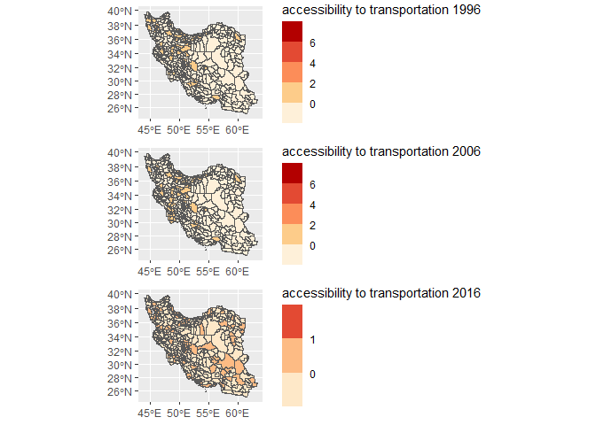

<!-- README.md is generated from README.Rmd. Please edit that file -->

# paccpack

<!-- badges: start -->
<!-- badges: end -->

The goal of paccpack is to measure the potential accessibility through
the intermodal transport network (road and railway) based on the
population and employment at the county scale in Iran from 1996 to 2016.

## Installation

You can install the development version of paccpack like so:

``` r
# FILL THIS IN! HOW CAN PEOPLE INSTALL YOUR DEV PACKAGE?
```

## Example

This is a basic example which shows you how to solve a common problem:

``` r
library(paccpack)
## basic example code
```

What is special about using `README.Rmd` instead of just `README.md`?
You can include R chunks like so:

``` r
summary(cars)
#>      speed           dist       
#>  Min.   : 4.0   Min.   :  2.00  
#>  1st Qu.:12.0   1st Qu.: 26.00  
#>  Median :15.0   Median : 36.00  
#>  Mean   :15.4   Mean   : 42.98  
#>  3rd Qu.:19.0   3rd Qu.: 56.00  
#>  Max.   :25.0   Max.   :120.00
```

You’ll still need to render `README.Rmd` regularly, to keep `README.md`
up-to-date. `devtools::build_readme()` is handy for this. You could also
use GitHub Actions to re-render `README.Rmd` every time you push. An
example workflow can be found here:
<https://github.com/r-lib/actions/tree/v1/examples>.

You can also embed plots, for example:

 ##
Available functions

Functions include models for calculating potential accessibility based
on population and employment from each county to another one.

Potential accessibility is a valuable method for measuring the benefits
of population and employment in a region and is one of the most popular
methods of calculating accessibility. Potential accessibility is the
main indicator of gravity-based measure that began with Harris (1954)
and Hansen (1959) and is commonly used to calculate the effects of
infrastructure development on growth, due to its ease of calculation,
interpretation, and communicability.

## Accessibility to transportation networks

``` r
library(sf)
library(ggplot2)
library(gridExtra)

accessibility <- read_sf("D:/packages/shp/accessibility.shp")

acc_2016 <- ggplot() + geom_sf(data = accessibility, aes(fill = acc_p_2016), size = 0.01) + labs(fill = "accessibility to transportation 2016") + 
   coord_sf(crs = "+proj=merc")

acc_2006 <- ggplot() + geom_sf(data = accessibility, aes(fill = acc_p_2006), size = 0.01) + labs(fill = "accessibility to transportation 2006") + 
   coord_sf(crs = "+proj=merc")
acc_1996 <- ggplot() + geom_sf(data = accessibility, aes(fill = acc_p_1996), size = 0.01) + labs(fill = "accessibility to transportation 1996") + 
   coord_sf(crs = "+proj=merc")
 
grid.arrange(acc_1996, acc_2006, acc_2016)
```



 In
that case, don’t forget to commit and push the resulting figure files,
so they display on GitHub and CRAN.
